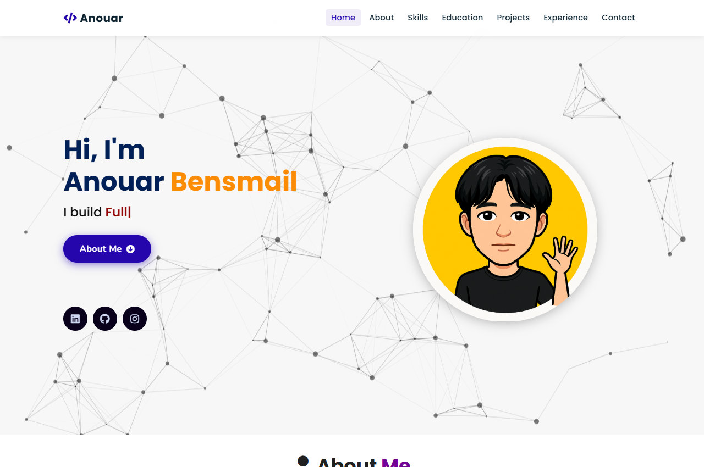
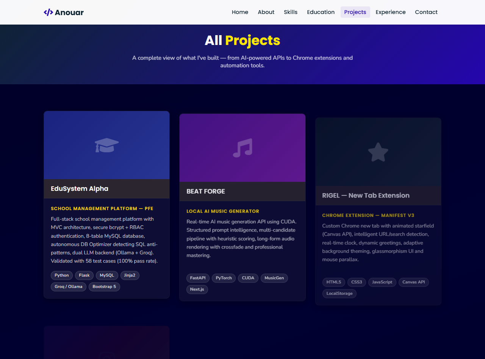

# Anouar Bensmail — Developer Portfolio

### **Full-Stack Developer & AI Engineering Student**
Marrakech, Morocco 📍

[**🌐 View Live Portfolio**](https://rigel-anouar.github.io/Portfolio/) &nbsp;|&nbsp; [**📄 View Resume (CV)**](cv.html)

---

## 📌 About The Project

This repository hosts the source code for my personal developer portfolio. Built using vanilla **HTML5**, **CSS3**, and modern **JavaScript**, it is designed to be lightweight, responsive, and fast without relying on heavy frontend frameworks.

It presents my real-world projects, technical skillset, professional internship experience, and academic background in web development and artificial intelligence.

---

## 💻 Tech Stack & Architecture

### Portfolio Stack
- **Frontend**: HTML5, CSS3 (Custom Properties & Glassmorphism), JavaScript (ES6), jQuery
- **Libraries**: Particles.js, Typed.js, Vanilla Tilt.js, ScrollReveal
- **Icons & Typography**: Font Awesome 5, Google Fonts (Poppins & Nunito)

### Core Developer Skills
- **Programming Languages**: Python (Advanced), JavaScript (ES6), HTML5, CSS3
- **Frameworks & Backends**: FastAPI, Next.js, Bootstrap 5, Django, Flask, Jinja2
- **AI & Data Engineering**: PyTorch, CUDA, Prompt Engineering, Audio Signal Processing, openpyxl
- **Databases**: MySQL, SQLite
- **Developer Tools**: Git, Selenium WebDriver, CustomTkinter, CapCut

---

## 🚀 Projects Showcase

### 1. [EduSystem Alpha](https://github.com/Rigel-anouar) — School Management Platform with DB Optimization (PFE)
- Full-stack web application (MVC architecture) featuring secure authentication (bcrypt) and Role-Based Access Control (RBAC) across 4 profiles: Administrator, Teacher, Student, and DBA.
- Relational MySQL database (8 tables) with parameterized queries protecting against SQL injection.
- **Autonomous DB Optimizer module**: monitors performance via MySQL `PERFORMANCE_SCHEMA`, detects 5 SQL anti-patterns, and generates recommendations through a 3-layer engine (index detection, query rewrite, impact prediction).
- Real-time Discord alerting system driven by dual asynchronous daemons with persistent cooldowns.
- Dual LLM backend integration (local Ollama + cloud Groq with static fallback), validated across 58 test cases (100% pass rate).
- **Tech Stack**: `Python`, `Flask`, `MySQL`, `SQLite`, `Bootstrap 5`, `Jinja2`, `bcrypt`, `Groq/Ollama LLM`

---

### 2. BEAT FORGE — Local AI Music Generator
- Real-time AI music generation API optimized with CUDA acceleration.
- Structured prompt intelligence with controllable generation parameters.
- Multi-candidate pipeline utilizing heuristic scoring and automated retry mechanisms.
- Long-form audio rendering in sequential blocks with crossfade joining and mastering.
- **Tech Stack**: `FastAPI`, `PyTorch`, `Meta MusicGen`, `Next.js`, `CUDA`, `NVIDIA RTX 3050`

---

### 3. RIGEL — New Tab Chrome Extension
- Chrome extension replacing the default new tab page with an immersive space UI.
- Interactive starfield with animated shooting stars rendered via Canvas API and `requestAnimationFrame`.
- Intelligent search bar with automatic query/URL detection, real-time clock, and dynamic greetings.
- Dynamic interface adaptation based on automatic analysis of background dominant colors.
- Built with glassmorphism styling, mouse parallax, and full Chrome Extension Manifest V3 / CSP compliance.
- **Tech Stack**: `HTML5`, `CSS3`, `JavaScript (ES6)`, `Canvas API`, `LocalStorage`, `Chrome MV3`

---

### 4. Instagram Automation Tool
- Desktop automation software managing Instagram subscription requests using Selenium WebDriver with secure session persistence.
- Modern dark-mode GUI built with CustomTkinter and multithreaded task execution to maintain interface fluidity and allow immediate cancellation.
- Comprehensive session logging generating structured reports (success rate, failures, timestamps, execution statistics).
- Modular architecture (`main.py`, `ui.py`, `bot.py`, `utils.py`) for clean maintainability.
- **Tech Stack**: `Python`, `Selenium WebDriver`, `CustomTkinter`, `Multithreading`

---

### 5. Professional Portfolio Website
- Fully custom, high-performance personal portfolio.
- Dynamic interactive particles, smooth scroll reveals, 3D card tilt physics, and integrated printable executive CV.
- **Tech Stack**: `HTML5`, `CSS3`, `JavaScript`, `Bootstrap`

---

## 💼 Professional Experience

### **Stagiaire Développeur en Automatisation**
**Tectra** — Marrakech, Morocco | *2025*
- Built an automated Python extraction tool to extract identity and administrative data (CIN, full names, etc.) from over 300+ unstructured PDF documents, eliminating repetitive manual entry.
- Engineered a data processing and mapping pipeline structuring extracted data into normalized Excel reports using `openpyxl`.
- Optimized operational workflow, reducing document processing duration by **60–70%** and virtually eliminating human transcription errors.
- **Technologies**: `Python`, `openpyxl`, `PDF Parsing`, `Workflow Automation`

---

## 🎓 Education

- **Technicien Spécialisé en Développement Informatique (Web & Logiciel)**  
  *École Racine — Marrakech, Morocco* | **2024 – 2027 (In Progress)**
- **Baccalauréat Sciences Physiques**  
  *Lycée Chkili — Marrakech, Morocco* | **2022 – 2023**

---

## 🌐 Languages

- **Arabic**: Native (Langue maternelle)
- **English**: Intermediate
- **French**: Beginner / Operational (Débutant opérationnel)

---

## 📬 Contact & Connect

I am currently open to **internships**, **junior developer positions**, and opportunities in **web development** and **AI engineering**.

- **Email**: [anouar.bensmail26@gmail.com](mailto:anouar.bensmail26@gmail.com)
- **Phone**: +212 771 845 747
- **LinkedIn**: [linkedin.com/in/rigel-anouar-8005a1343](https://www.linkedin.com/in/rigel-anouar-8005a1343/)
- **GitHub**: [github.com/Rigel-anouar](https://github.com/Rigel-anouar)
- **Location**: Marrakech, Morocco

---

  Designed & Developed by Anouar Bensmail © 2025–2026

